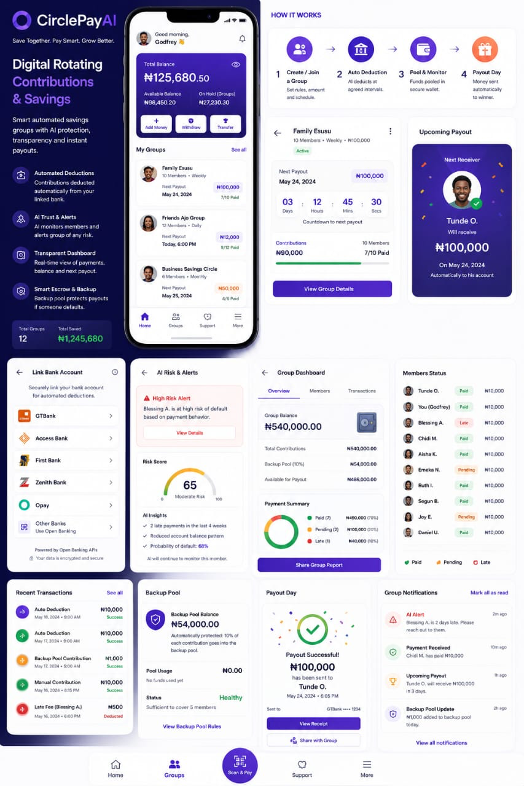
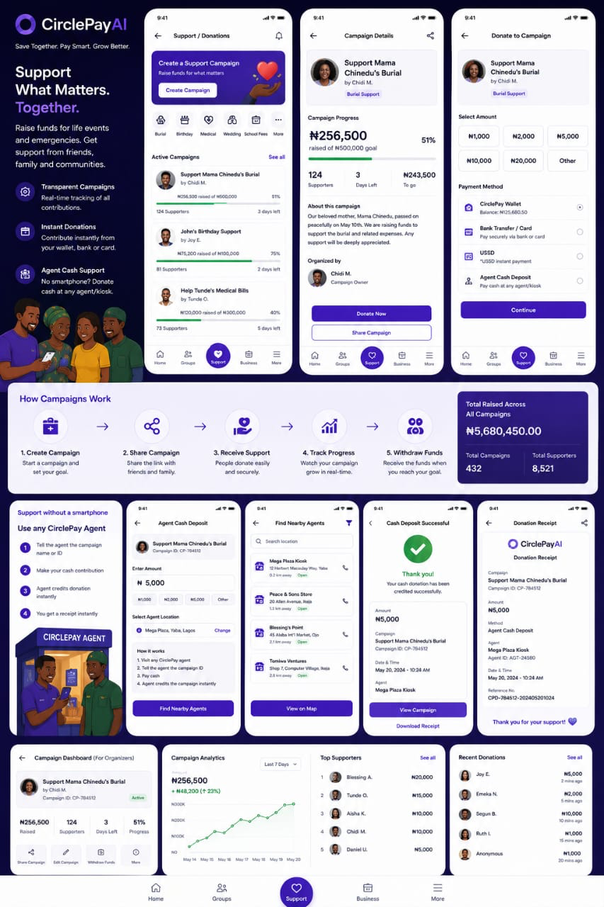
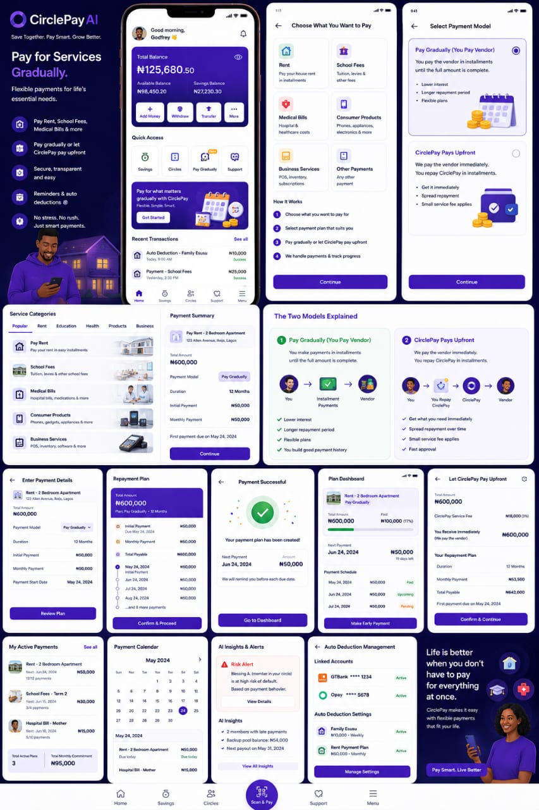
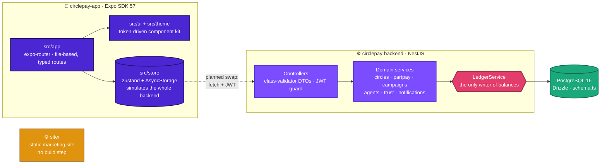

<div align="center">

# 🟣 CirclePay AI

### **Save Together. Pay Smart. Grow Better.**

**The operating system for community finance.**
Digitising the rotating-savings culture of **Ajo · Esusu · Adashi · Susu · Chama** —
with escrow, a backup pool and an AI trust layer protecting every payout.

<br/>


</div>

---

## 🌍 Why this exists

Millions of Nigerians already save together. They run **Ajo**, **Esusu**, **Adashi**,
**Susu** and **Chama** circles — pooling money weekly, paying out in rotation, held
together by trust and social pressure. It works, and banks largely ignore it, because
banks only score *individual* credit history.

CirclePay AI takes that culture and makes it **safe, transparent and automatic** —
without asking anyone to abandon how they already save.

> **Built for the people banks skip:** salary earners and traders in savings groups,
> unbanked users with no smartphone who rely on agents and scratch cards, families
> raising funds for burials and school fees, and the kiosk operators who serve them.

---

## ✨ The four pillars

| | Pillar | What it does |
|:--:|:--|:--|
| 🔄 | **Circles** | Rotating savings groups with automated deductions, live payout countdowns, escrow, and a **backup pool** that covers a payout when someone defaults |
| 💳 | **PartPay** | Split big bills — rent, school fees, medical — into installments. Two models: *pay the vendor gradually*, or *CirclePay pays upfront* and you repay |
| ❤️ | **CircleSupport** | Community fundraising for life events — burials, weddings, medical, school fees — with transparent tracking and shareable receipts |
| 🏪 | **Agent network** | Kiosks, scratch cards and one-time withdrawal codes, so the **offline majority** can save and cash out without a smartphone or bank account |
| 🛡️ | **Trust** | An AI layer scoring trust and predicting default risk, wrapping all of the above with alerts before money goes missing |

---

## 📱 The product

<div align="center">

### 🔄 Circles — digital rotating contributions & savings


### ❤️ CircleSupport — support what matters, together


### 💳 PartPay — pay for services gradually


</div>

---

## 🏗️ Architecture

Three independent deliverables built from one shared spec.



### 🔐 The one invariant that matters

**Every money movement is atomic and appends a user-visible transaction.**

On the backend, `LedgerService` is the *only* place a wallet balance changes. Feature
services open a `db.transaction` and call `ledger.move(tx, …)`, so domain writes and the
balance change commit together or not at all. Balance reads inside a transaction take
`SELECT … FOR UPDATE`. The app store enforces the same rule client-side.

Money is stored as `numeric(14,2)` — exact decimal, never float.

### 🔗 How the app and backend fit together

The app currently runs **entirely off its zustand store**, which simulates the backend
end to end — ledger, auto-debits, payouts, donations, scratch cards, withdrawal codes.
The backend was written to replace it: its response DTOs match
`circlepay-app/src/store/types.ts` **field for field**, so going live means swapping store
actions for `fetch` + a JWT in `AsyncStorage`, not remodelling the domain.

> ⚠️ **That 1:1 correspondence is the integration plan.** Change a domain type on one
> side, change it on the other.

---

## 🚀 Quick start

### 📱 The app

```bash
cd circlepay-app
npm install
npm run web        # http://localhost:8081 — fastest way to try it
npm run ios        # requires Xcode
npm run android
```

Onboard with **any** phone number, **any** 6-digit OTP, **any** 4-digit PIN.
**More → Reset Demo Data** restores the seed state.

### ⚙️ The backend

```bash
cd circlepay-backend
cp .env.example .env
npm install

docker compose up -d     # Postgres 16 on host port 5433 (not 5432)
npm run db:generate      # SQL migrations from schema.ts
npm run db:migrate       # apply them   (or: npm run db:push)
npm run db:seed          # demo data

npm run start:dev        # http://localhost:4000/api
```

Log in as the seeded demo user with phone **`+234 803 555 0147`** — with
`OTP_DEV_MODE=true` the API returns the OTP code in the response. Any other phone
creates a fresh, zero-balance account.

```bash
curl localhost:4000/api/health
curl -sX POST localhost:4000/api/auth/request-otp \
  -H 'content-type: application/json' -d '{"phone":"+234 803 555 0147"}'
```

### 🌐 The marketing site

No build, no dependencies:

```bash
python3 -m http.server 4173 --directory site
```

---

## 🎯 Try these flows

- **Onboarding** — welcome → OTP → KYC tiers → PIN + Face ID
- **Circles** — open *Family Esusu*: live payout countdown, member paid/late status,
  backup pool, AI default alert. **Simulate payout day** fires the payout celebration
- **PartPay** — start a plan (category → payment model → schedule review), then make
  early payments from the plan dashboard
- **CircleSupport** — donate to *Support Mama Chinedu's Burial* (your wallet balance
  actually moves) and get a shareable receipt
- **Agent network** — redeem a scratch card (any 14–16 digit serial), or request a kiosk
  withdrawal for a 5-minute one-time code with full fee breakdown
- **Trust** — More → Trust Score / AI Risk & Alerts

---

## 🗂️ Repository layout

```
circlepay/
├── circlepay-app/        📱 Expo SDK 57 · React Native · TypeScript
│   ├── src/app/             expo-router routes (file-based, typed)
│   ├── src/ui/              shared kit: Screen, Card, Gauge, CountdownTimer, …
│   ├── src/store/           zustand: types, seed data, all domain actions
│   ├── src/theme/tokens.ts  design tokens — the styling source of truth
│   └── AGENTS.md            ⚠️ app conventions + SDK 57 sharp edges
│
├── circlepay-backend/    ⚙️ NestJS · Drizzle · PostgreSQL
│   ├── src/db/schema.ts     single source of truth for the database
│   ├── src/wallet/          wallet + LedgerService
│   └── src/{auth,users,circles,partpay,campaigns,agents,trust,notifications}/
│
├── site/                 🌐 static marketing site (9 pages, one stylesheet)
├── docs/                 🖼️ product mockup boards
├── designs/design-spec.md   🎨 visual source of truth for the app
├── prd.md                   📋 full product requirements
├── PRODUCT.md               💜 brand, audience, design principles
└── CLAUDE.md                🤖 architecture + commands for AI agents
```

---

## 🎨 Design system

Extracted from the mockups into `circlepay-app/src/theme/tokens.ts` — **never hardcode a
hex value or font string in a screen.**

| | Token | Hex | Use |
|:--:|:--|:--|:--|
|  | `primary` | `#4B27D4` | Brand, primary actions |
|  | `accent` | `#7C4DFF` | Highlights, gradients |
|  | `primaryDeep` | `#231060` | Dark hero surfaces |
|  | `success` | `#1BA87A` | Paid, healthy, confirmed |
|  | `warning` | `#E0930F` | Pending, due soon |
|  | `danger` | `#E23D6B` | Late, high risk, defaults |
|  | `ink` | `#1A1B2E` | Body text |

**Type:** Plus Jakarta Sans for UI · JetBrains Mono for every ₦ amount (via `AmountText`)
**Icons:** Ionicons only · **Charts:** `react-native-svg`

### ♿ Accessibility is not optional

WCAG 2.1 AA contrast · visible focus states · full `prefers-reduced-motion` support ·
never colour alone for status (always paired with an icon or label) · low-bandwidth
conscious, SVG over raster.

---

## 📋 Project status

Honest about where this actually is — candour is how a money brand earns belief.

| Area | Status |
|:--|:--|
| 📱 App UI & flows | ✅ Complete across all pillars |
| 🗄️ Backend API | ✅ Built — every module and endpoint |
| 🔗 App ↔ backend wiring | ⏳ **Not yet connected** — app runs on the simulated store |
| 💬 OTP & payments | 🟡 Simulated (no SMS provider or payment gateway yet) |
| 🧠 Trust / risk scoring | 🟡 Seeded and static — not a live model yet |
| 🧪 Test suite | ❌ **None.** Verification is `tsc --noEmit` + manual flows |
| 🌐 Marketing site | ✅ 9 pages, static, no build step |

### 🛣️ Toward production

- Swap `numeric` money for integer minor units (kobo) and a full double-entry ledger
- Real SMS (Termii/Twilio) and payments (Paystack/Flutterwave)
- BullMQ scheduler for auto-debits, payouts, reminders and grace-period retries
- Move trust/risk scoring into its own service
- Refresh tokens, OTP rate limiting, audit logging

---

## 📚 Further reading

| Doc | What's in it |
|:--|:--|
| [`prd.md`](prd.md) | Full product requirements — the functional source of truth |
| [`PRODUCT.md`](PRODUCT.md) | Brand, audience, design principles and anti-references |
| [`designs/design-spec.md`](designs/design-spec.md) | Visual source of truth for the app |
| [`circlepay-app/AGENTS.md`](circlepay-app/AGENTS.md) | App conventions + Expo SDK 57 sharp edges |
| [`circlepay-backend/README.md`](circlepay-backend/README.md) | Full endpoint table and backend detail |
| [`CLAUDE.md`](CLAUDE.md) | Architecture, commands and gotchas for AI agents |

---

<div align="center">

**We already know how to save together.**
**CirclePay just makes it safe, transparent and automatic.**

<sub>Built for Nigeria 🇳🇬 · expanding to Africa and emerging markets</sub>

</div>
